# Module 13 — Calculator App

A FastAPI-based calculator application with PostgreSQL persistence, JWT authentication, Docker containerization, and a full CI/CD pipeline. This module builds on the polymorphic SQLAlchemy models and Pydantic schemas from Module 11 by adding JWT-based user registration/login routes, front-end HTML pages, Playwright E2E tests, and production-ready deployment.

---

## Table of Contents

1. [What Was Built](#what-was-built)
2. [Project Structure Changes](#project-structure-changes)
3. [How to Run Locally](#how-to-run-locally)
4. [Running the Front-End Pages](#running-the-front-end-pages)
5. [Running the Tests](#running-the-tests)
6. [API Endpoints](#api-endpoints)
7. [How the Calculation Model Works](#how-the-calculation-model-works)
8. [How the Pydantic Schemas Work](#how-the-pydantic-schemas-work)
9. [Factory Pattern Explained](#factory-pattern-explained)
10. [JWT Authentication](#jwt-authentication)
11. [CI/CD Pipeline](#cicd-pipeline)
12. [Docker Hub](#docker-hub)
13. [Output Screenshots](#output-screenshots)

---

## What Was Built

| Feature | Details |
|---|---|
| JWT Registration | `POST /register` — validates, hashes password, stores user, returns JWT |
| JWT Login | `POST /login` — validates credentials, returns JWT or 401 |
| Register Page | `register.html` — username + password form with client-side validation |
| Login Page | `login.html` — username + password form, stores JWT on success |
| Tests | Unit test, Integration test & E2E test for all functionality |
| CI/CD | GitHub Actions: spins up DB, runs Playwright tests, pushes to Docker Hub |

---

## Project Structure Changes

```
module13-calculator-app/
├── .github/
│   └── workflows/
│       └── ci.yml               # GitHub Actions CI/CD pipeline
├── .vscode/                     # VS Code workspace settings
├── app/
│   ├── main.py                  # FastAPI app entry point
│   ├── auth.py                  # JWT creation & verification helpers
│   ├── models.py                # SQLAlchemy models (User + Calculation polymorphic)
│   ├── schemas.py               # Pydantic request/response schemas
│   ├── database.py              # SQLAlchemy session setup
│   └── routers/
│       ├── auth_router.py       # /register and /login routes
│       └── calculations.py      # Calculation CRUD routes
├── static/                      # CSS and JS assets served by FastAPI
├── templates/                   # Jinja2 HTML templates
│   ├── register.html            # Registration front-end page
│   └── login.html               # Login front-end page
├── tests/
│   ├── test_calculations.py     # Pytest unit tests
│   └── e2e/
│       └── test_auth.spec.js    # Playwright E2E tests
├── .gitignore
├── Dockerfile
├── LICENSE
├── README.md
├── docker-compose.yml
├── init-db.sh                   # DB initialization script
├── pytest.ini                   # Pytest configuration
└── requirements.txt
```

## How to Run Locally

### Prerequisites

- Docker & Docker Compose
- Python 3.11+
- Node.js 18+ (for Playwright)

### 1. Clone the Repository

```bash
git clone https://github.com/tl392/module13-calculator-app.git
cd module13-calculator-app
```

### 2. Set Environment Variables

Create a `.env` file in the project root:

```env
DATABASE_URL=postgresql://postgres:password@db:5432/calculator
SECRET_KEY=your-super-secret-jwt-key
ALGORITHM=HS256
ACCESS_TOKEN_EXPIRE_MINUTES=30
```

### 3. Start with Docker Compose

```bash
docker compose up --build
```

The API will be available at `http://localhost:8000`.

### 4. Run Without Docker (for local development)

```bash
# Create and activate virtual environment
python -m venv venv
source venv/bin/activate  # Windows: venv\Scripts\activate

# Install dependencies
pip install -r requirements.txt

# Start a local PostgreSQL instance, then run:
uvicorn app.main:app --reload --host 0.0.0.0 --port 8000
```

---

## Running the Front-End Pages

The HTML pages are served via FastAPI using **Jinja2 templates** (located in the `templates/` folder), with CSS/JS assets served from the `static/` folder.

Once the server is running, open your browser and navigate to:

| Page | URL |
|---|---|
| Register | `http://localhost:8000/register` |
| Login | `http://localhost:8000/login` |
| API Docs | `http://localhost:8000/docs` |

### register.html

- Fields: **Username**, **Email**, **Password**, **Confirm Password** (and other optional fields)
- Client-side validation: checks email format and minimum password length (8 characters)
- On success (201): displays a success message and redirects to login
- On failure (400 duplicate): displays an inline error message

### login.html

- Fields: **Username**, **Password**
- Client-side checks: non-empty fields, basic email format
- On success (200): stores the JWT in `localStorage` and displays a success message
- On failure (401): displays "Invalid credentials" error message

---

## Running the Tests

### Unit Tests (Pytest)

```bash
# Locally
pytest tests/unit -v
```
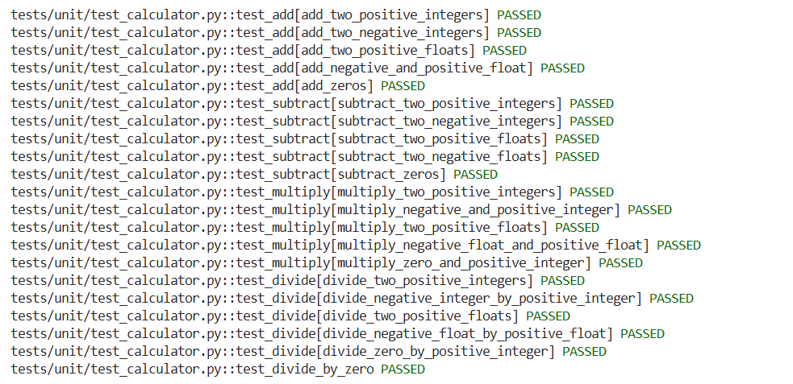

### Integration tests

```bash
# Locally
pytest tests/integration/
```
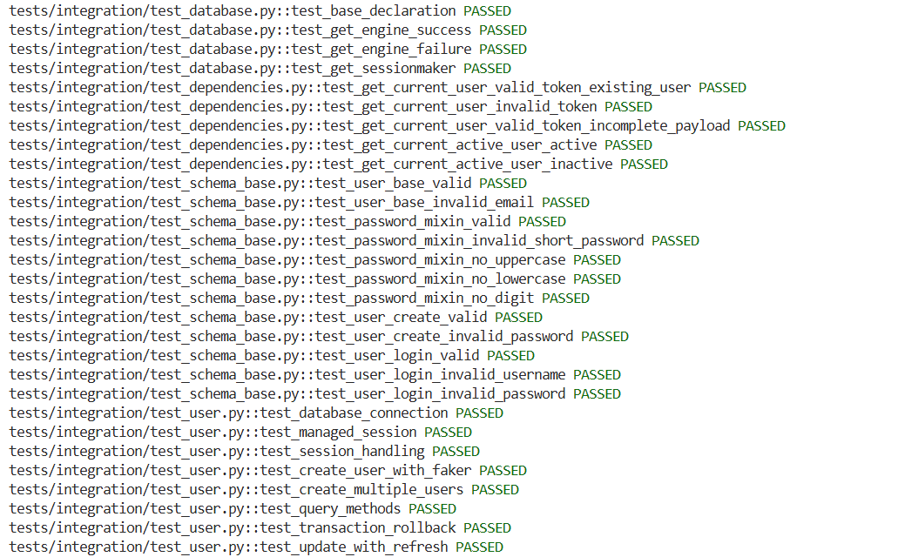

### E2E Tests

```bash
# Locally
pytest tests/e2e/
```
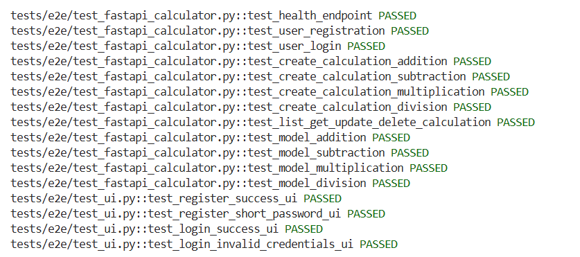


## API Endpoints

### Authentication

| Method | Endpoint | Description | Auth Required |
|---|---|---|---|
| POST | `/register` | Register a new user | No |
| POST | `/login` | Login and receive JWT | No |

#### POST `/register`

**Request body:**
```json
{
  "email": "user@example.com",
  "password": "securepassword123"
}
```

**Responses:**
- `201 Created` — `{ "access_token": "<jwt>", "token_type": "bearer" }`
- `400 Bad Request` — Email already registered
- `422 Unprocessable Entity` — Validation error

#### POST `/login`

**Request body:**
```json
{
  "email": "user@example.com",
  "password": "securepassword123"
}
```

**Responses:**
- `200 OK` — `{ "access_token": "<jwt>", "token_type": "bearer" }`
- `401 Unauthorized` — Invalid credentials

### Calculations

| Method | Endpoint | Description | Auth Required |
|---|---|---|---|
| GET | `/calculations` | List all calculations | Yes (Bearer token) |
| POST | `/calculations` | Create a calculation | Yes (Bearer token) |
| GET | `/calculations/{id}` | Get one calculation | Yes (Bearer token) |
| DELETE | `/calculations/{id}` | Delete a calculation | Yes (Bearer token) |

**Include the JWT in protected requests:**
```
Authorization: Bearer <your_token>
```

---

## How the Calculation Model Works

The `Calculation` model uses SQLAlchemy's **single-table inheritance** (polymorphic) pattern. A single `calculations` table stores all calculation types, distinguished by a `type` discriminator column.

```python
class Calculation(Base):
    __tablename__ = "calculations"
    id = Column(Integer, primary_key=True)
    type = Column(String, nullable=False)   # discriminator: "addition", "subtraction", etc.
    a = Column(Float, nullable=False)
    b = Column(Float, nullable=False)
    result = Column(Float, nullable=False)

    __mapper_args__ = {"polymorphic_on": type}

class Addition(Calculation):
    __mapper_args__ = {"polymorphic_identity": "addition"}

class Subtraction(Calculation):
    __mapper_args__ = {"polymorphic_identity": "subtraction"}
```

Each subclass overrides a `compute()` method to perform its operation. The result is computed at creation time and stored in the `result` column.

---

## How the Pydantic Schemas Work

Pydantic schemas separate the API contract from the database layer:

```python
class CalculationCreate(BaseModel):
    type: str          # "addition", "subtraction", "multiplication", "division"
    a: float
    b: float

class CalculationResponse(BaseModel):
    id: int
    type: str
    a: float
    b: float
    result: float

    class Config:
        from_attributes = True
```

`from_attributes = True` (formerly `orm_mode`) allows Pydantic to read data directly from SQLAlchemy ORM objects.

---

## Factory Pattern Explained

A `CalculationFactory` maps the incoming `type` string to the correct subclass and computes the result:

```python
class CalculationFactory:
    _registry = {
        "addition": Addition,
        "subtraction": Subtraction,
        "multiplication": Multiplication,
        "division": Division,
    }

    @classmethod
    def create(cls, type: str, a: float, b: float) -> Calculation:
        klass = cls._registry.get(type)
        if not klass:
            raise ValueError(f"Unknown calculation type: {type}")
        result = klass.compute(a, b)
        return klass(type=type, a=a, b=b, result=result)
```

This keeps route handlers clean — they call `CalculationFactory.create(...)` without needing to know which subclass to instantiate.

---

## JWT Authentication

### How It Works

1. User registers → password is hashed with **bcrypt** → user stored in DB → JWT returned
2. User logs in → password verified against hash → JWT returned on success, 401 on failure
3. Protected routes extract the token from the `Authorization: Bearer <token>` header, decode it with the `SECRET_KEY`, and identify the user

### Key Files

| File | Purpose |
|---|---|
| `app/auth.py` | `create_access_token()`, `verify_token()`, `hash_password()`, `verify_password()` |
| `app/routers/auth_router.py` | `/register` and `/login` FastAPI route handlers |
| `app/models.py` | `User` model with `email` (unique) and `hashed_password` columns |

### Token Payload

```json
{
  "sub": "user@example.com",
  "exp": 1712345678
}
```

---

## CI/CD Pipeline

The GitHub Actions workflow (`.github/workflows/ci.yml`) runs on every push and pull request to `main`:

```
Push to main
    │
    ▼
Spin up PostgreSQL service container
    │
    ▼
Install Python dependencies
    │
    ▼
Run Pytest unit tests
    │
    ▼
Install Node + Playwright browsers
    │
    ▼
Start FastAPI server (background)
    │
    ▼
Run Playwright E2E tests
    │
    ▼
All pass? → Build Docker image → Push to Docker Hub
```

### Secrets Required (GitHub → Settings → Secrets)

| Secret | Value |
|---|---|
| `DOCKER_USERNAME` | Your Docker Hub username |
| `DOCKER_PASSWORD` | Your Docker Hub password or access token |
| `SECRET_KEY` | Your JWT secret key |

---

## Docker Hub

The production image is automatically built and pushed to Docker Hub on every successful CI run.

**Image:** `docker.io/ltaravindh392/module13-calculator-app:latest`

### Pull and Run from Docker Hub

```bash
docker pull ltaravindh392/module13-calculator-app:latest

docker run -d \
  -p 8000:8000 \
  -e DATABASE_URL=postgresql://postgres:password@<db-host>:5432/calculator \
  -e SECRET_KEY=your-secret-key \
  ltaravindh392/module13-calculator-app:latest
```

**Docker Hub Repository:** [https://hub.docker.com/r/ltaravindh392/module13-calculator-app](https://hub.docker.com/r/ltaravindh392/module13-calculator-app)

---

## Output Screenshots
**Landing Screen**
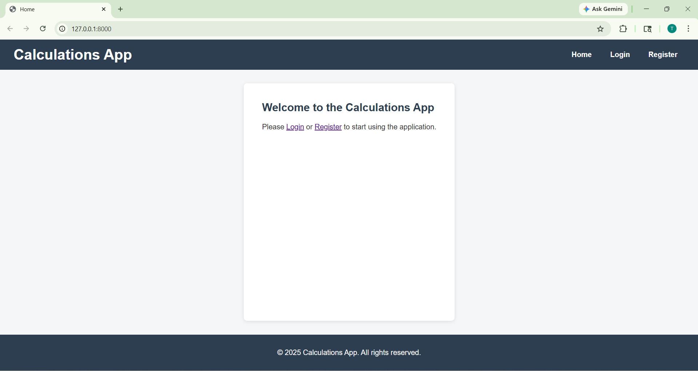

**Register User Screen**
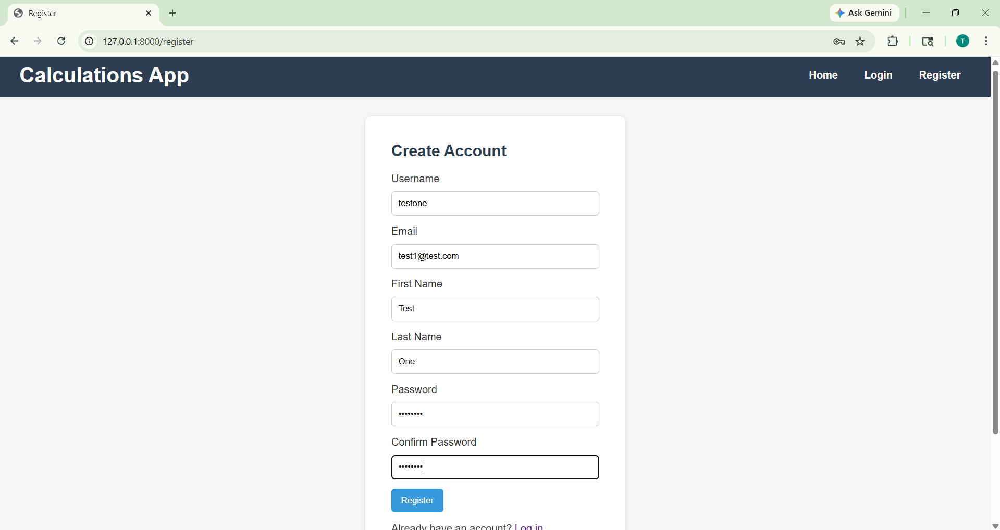

**Login Screen**
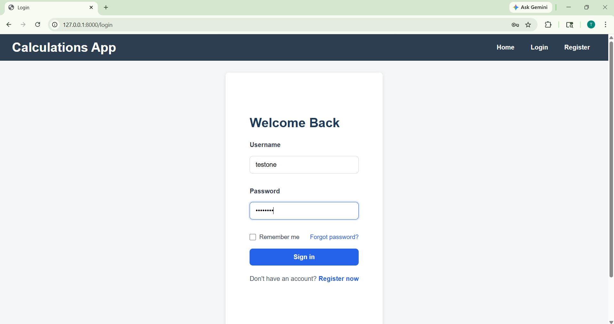

**Successful Login**
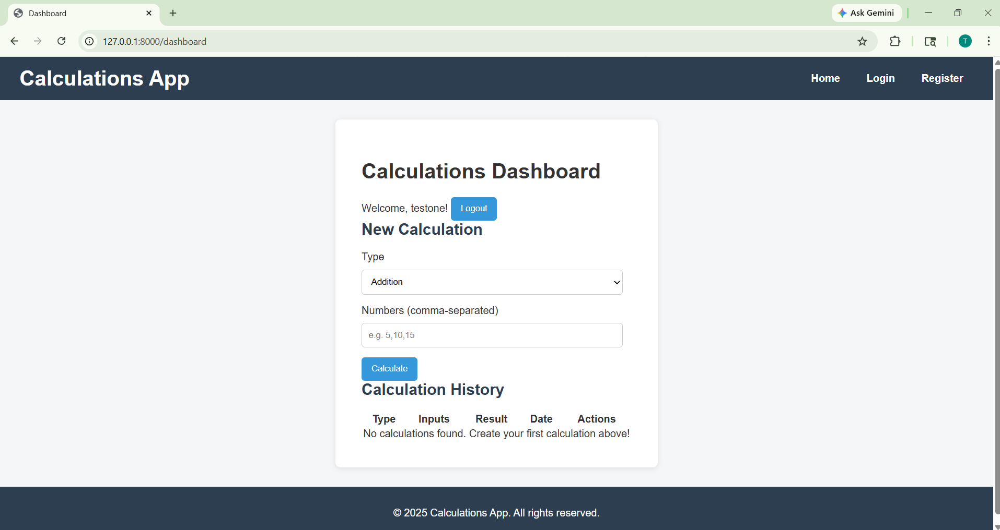

**Empty Form Submit**
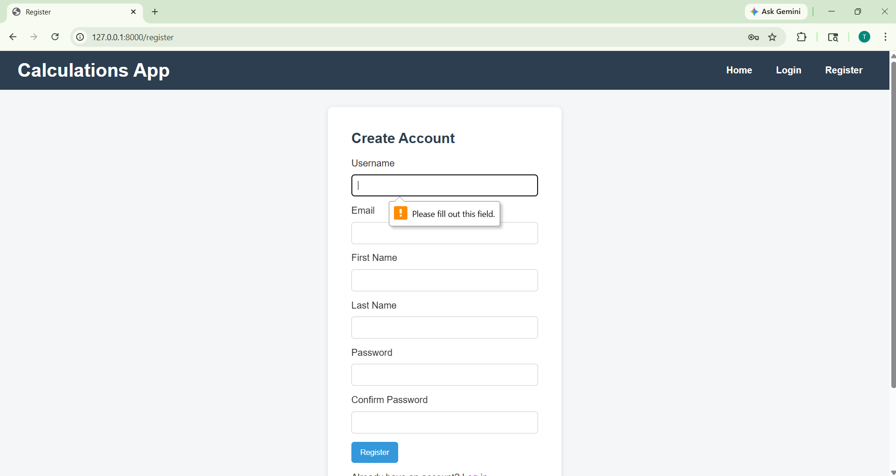

**Register with same username or email**
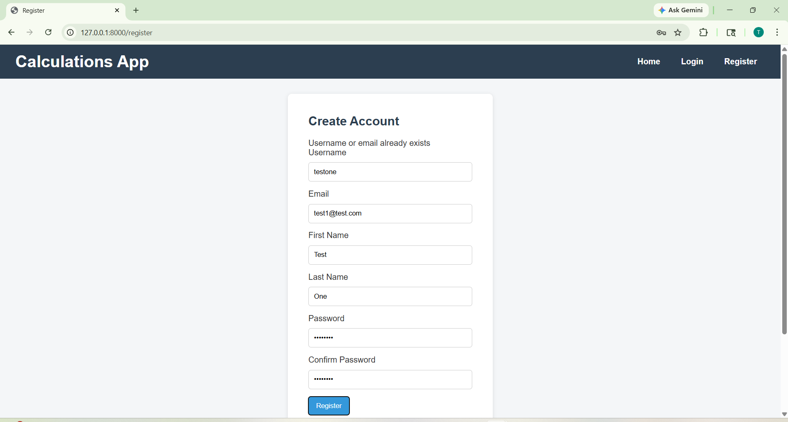

**Register with short password**
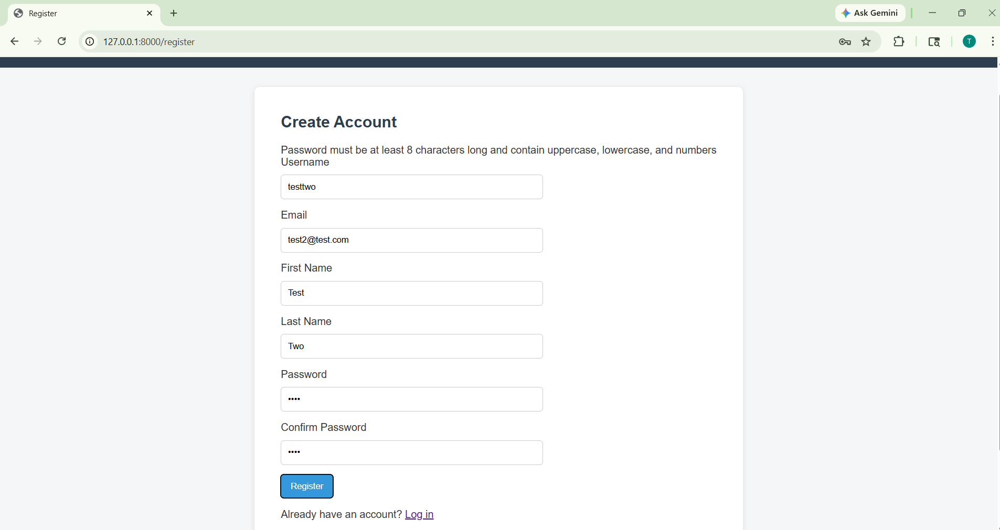

**Invalid Credential**
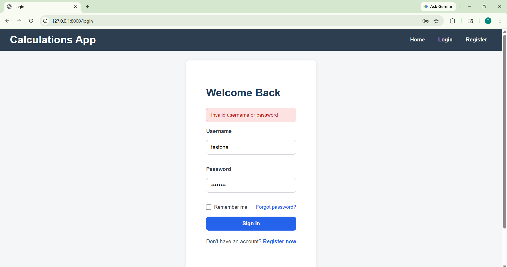
